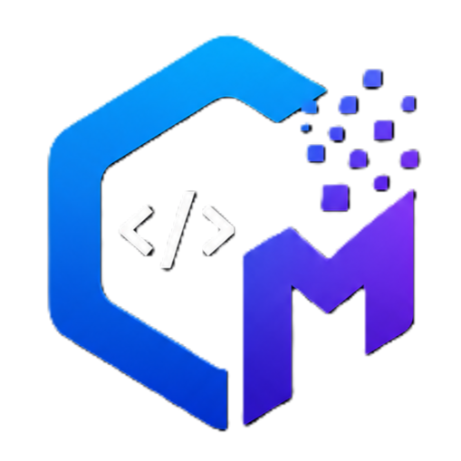
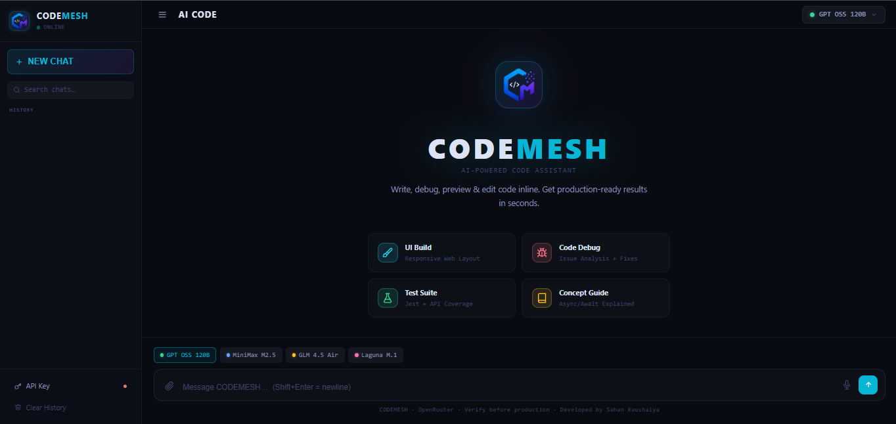
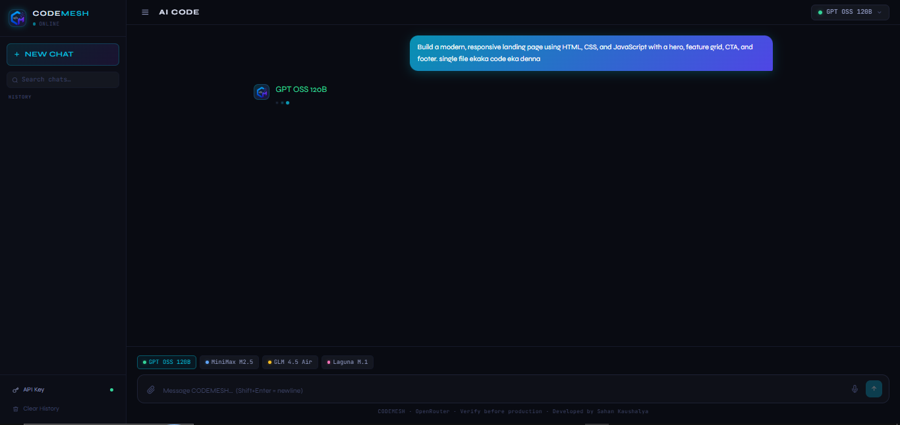
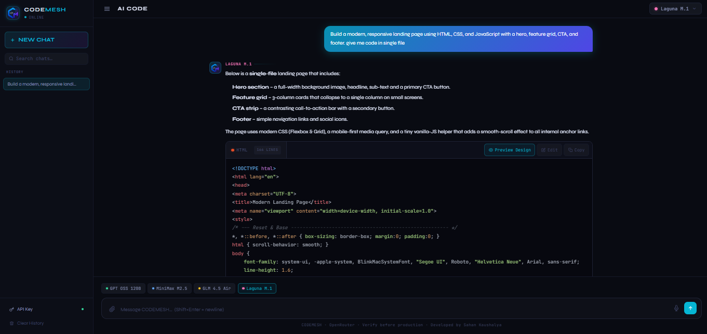
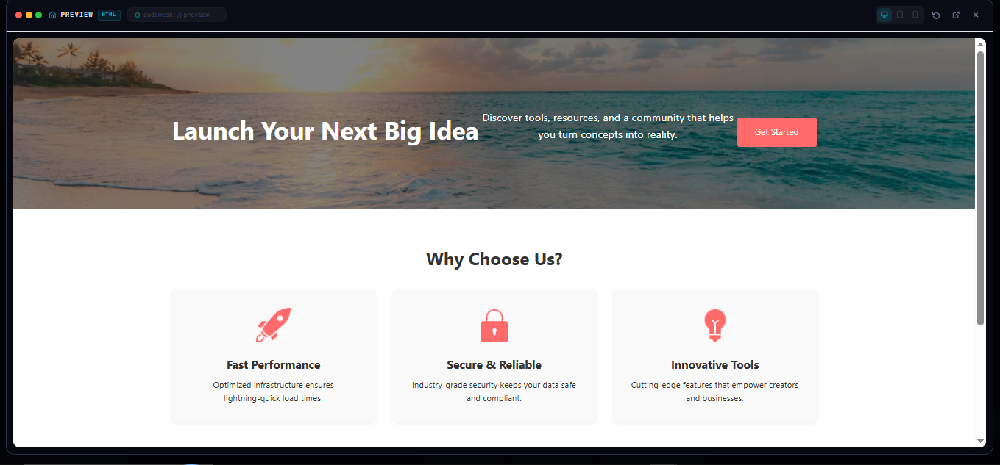
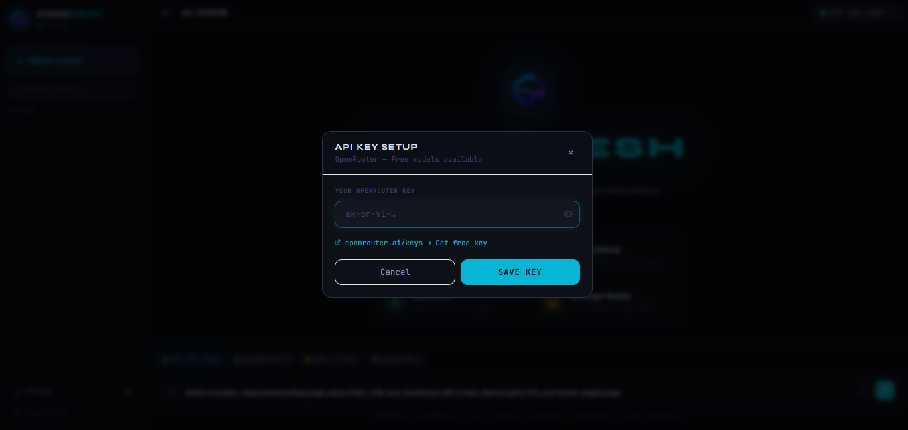

# 🔷 CODEMESH — AI Code Assistant

<div align="center">




**A fully functional AI-powered code assistant built with HTML, Tailwind CSS & Vanilla JS.**  
Powered by [OpenRouter API](https://openrouter.ai) · Free models · No backend required.

[🚀 Live Demo](#) · [📹 Video Demo](#) · [🐛 Report Bug](../../issues) · [💡 Request Feature](../../issues)

</div>

---

## ✨ Features

### 🤖 Multi-Model AI Support
| Model | Provider | Specialty |
|-------|----------|-----------|
| `openai/gpt-oss-120b:free` | OpenAI | Large open-source reasoning |
| `minimax/minimax-m2.5:free` | MiniMax | Efficient & capable |
| `z-ai/glm-4.5-air:free` | Z-AI | Lightweight fast inference |
| `poolside/laguna-m.1:free` | Poolside | Code-specialized |

### 🧠 Core Capabilities
- **💬 Multi-turn Chat** — Full conversation history with context window
- **🔄 Model Switching** — Switch models mid-conversation from header dropdown or quick chips
- **📝 Inline Code Editing** — Edit AI-generated code directly in the response using a full CodeMirror editor
- **👁️ Live Preview** — Render HTML/CSS/JS code instantly in a sandboxed iframe preview modal
- **📱 Responsive Viewports** — Preview designs in Desktop / Tablet / Mobile viewports
- **🎨 Syntax Highlighting** — Powered by Highlight.js with Atom One Dark theme
- **📋 Copy to Clipboard** — One-click copy for individual code blocks or full responses
- **🔁 Regenerate** — Re-run any AI response with the same or different model
- **💾 Chat History** — Sessions auto-saved to `localStorage`, load/delete past chats
- **🔍 History Search** — Filter saved chats by keyword
- **🎙️ Voice Input** — Web Speech API integration for hands-free coding
- **🔔 Toast Notifications** — Contextual feedback for all user actions
- **⌨️ Keyboard Shortcuts** — `Ctrl+K` to focus input, `Esc` to close modals

---

## 🖥️ Preview

<div align="center">


</div>

### Main Interface


### AI Typing State


### AI Response with Editing


### Preview Mode


---

## 🚀 Quick Start

### 1. Clone the repository
```bash
git clone https://github.com/Sahan-Kaushalya/AI-Code-Assistant.git
cd AI-Code-Assistant
```

### 2. Get your free OpenRouter API key
Visit **[openrouter.ai/keys](https://openrouter.ai/keys)** and create a free account.  
All 4 models used in CODEMESH are **completely free** to use.

### 3. Open the app
```bash
# Simply open in your browser — no server needed!
open index.html
# or
npx serve .
```

### 4. Enter your API key
Click the **API Key** button in the sidebar → paste your `sk-or-v1-...` key → **Save**.



That's it! 🎉

---

## 📁 Project Structure

```
ai-code-assistant/
├── index.html        # Main HTML — layout, modals, all structure
├── styles.css        # Custom CSS — dark theme, animations, components
├── script.js         # Core logic — API calls, rendering, state management
├── ui/               # UI screenshots and assets
│   ├── logo.png
│   ├── logoname.png
│   ├── main-ui.png
│   ├── ai-reply-msg.png
│   ├── ai-typing.png
│   ├── ai-preview.png
│   └── api-key-setup.png
└── README.md         # You are here
```

> **Zero dependencies** — No npm, no build step, no bundler.  
> Everything loads via CDN. Works offline after first load.

---

## 🛠️ Tech Stack

| Technology | Purpose |
|------------|---------|
| HTML5 + Tailwind CSS | Layout & utility styling |
| Vanilla JavaScript (ES2022) | All logic, no framework |
| OpenRouter API | AI model routing |
| Highlight.js | Syntax highlighting |
| CodeMirror 5 | Inline code editor |
| Marked.js | Markdown → HTML rendering |
| Web Speech API | Voice input |
| localStorage | Session persistence |

---

## 💡 How to Use

### Sending Messages
- Type in the input box → press **Enter** to send (or **Shift+Enter** for new line)
- Use the quick model chips to switch models before sending
- Click suggestion cards on the welcome screen for prompt ideas

### Code Blocks
Every AI code response comes with a smart code block header:

```
● JAVASCRIPT  18 lines    [Preview Design] [Edit] [Copy]
```

| Button | What it does |
|--------|-------------|
| **Preview Design** | Opens live iframe preview (HTML/CSS/JS/SVG only) |
| **Edit** | Opens CodeMirror inline editor — edit & apply changes |
| **Copy** | Copies raw code to clipboard |

### Preview Modal
- Resize preview with **Desktop / Tablet / Mobile** viewport buttons
- **Open in new tab** to share or screenshot
- **Refresh** to re-render after edits

### Chat History
- All sessions auto-save after each AI reply
- Click any session in the sidebar to restore it
- Hover a session → click **×** to delete
- Use the search bar to filter by keyword

---

## 🔐 API Key Security

Your API key is stored **only in your browser's `localStorage`** — it never leaves your device and is never sent to any server other than `openrouter.ai`.

```javascript
// Key is only used in direct fetch calls to OpenRouter
headers: {
  'Authorization': `Bearer ${apiKey}`,
}
```

---

## ⚙️ Configuration

You can customise default models or add new ones by editing the `MODELS` array in `script.js`:

```javascript
const MODELS = [
  {
    id:       'openai/gpt-oss-120b:free',
    name:     'GPT OSS 120B',
    color:    '#34d399',
    provider: 'OpenAI',
    desc:     'Large open-source model',
  },
  // Add more models from openrouter.ai/models
];
```

Browse all available models at **[openrouter.ai/models](https://openrouter.ai/models)**.

---

## 🤝 Contributing

Contributions are welcome! Feel free to:

1. Fork the repository
2. Create a feature branch (`git checkout -b feature/amazing-feature`)
3. Commit your changes (`git commit -m 'Add amazing feature'`)
4. Push to the branch (`git push origin feature/amazing-feature`)
5. Open a Pull Request

---

## 📄 License

Distributed under the MIT License. See `LICENSE` for more information.

---

## 🙏 Acknowledgements

- [OpenRouter](https://openrouter.ai) — Free AI model API routing
- [Tailwind CSS](https://tailwindcss.com) — Utility-first CSS framework
- [Highlight.js](https://highlightjs.org) — Syntax highlighting
- [CodeMirror](https://codemirror.net) — In-browser code editor
- [Marked.js](https://marked.js.org) — Markdown parser

---

<div align="center">

Built with ❤️ and a lot of `console.log()` debugging

⭐ **Star this repo** if you found it useful!

[](https://github.com/Sahan-Kaushalya/AI-Code-Assistant)

</div>
